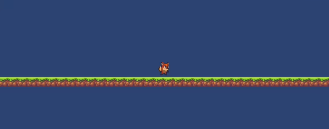
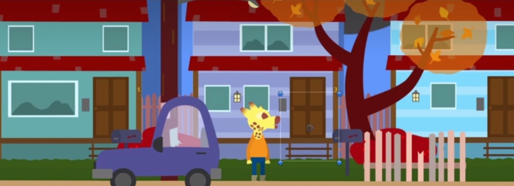
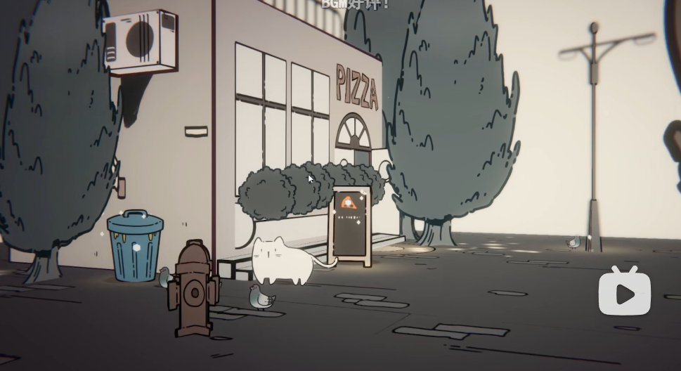
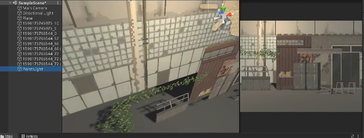
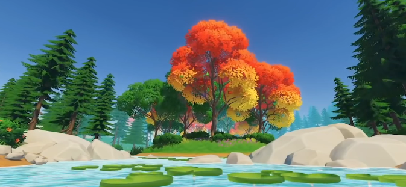
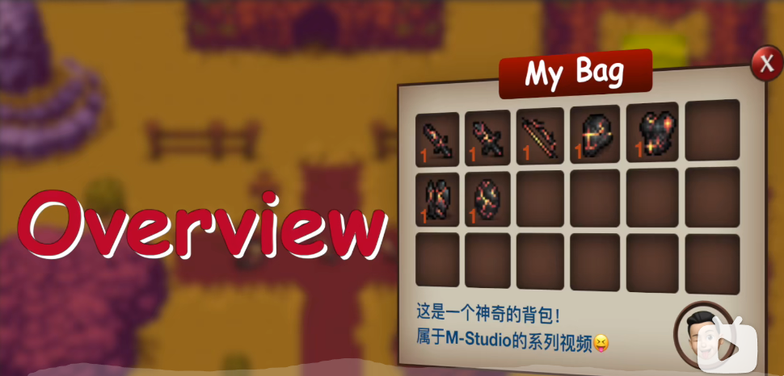
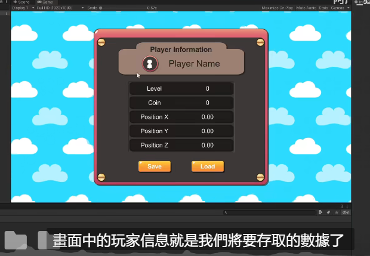

# 人物行走与背景移动

- [unity横板+完美手感实现](https://www.bilibili.com/video/BV1YJ411H7vc?share_source=copy_web)
- [视差滚动效果](https://www.bilibili.com/video/BV1m34y1S7up?share_source=copy_web)
- [可参考](https://www.bilibili.com/video/BV1rb4y187FF?share_source=copy_web)
- [unity2d光照](https://www.bilibili.com/video/BV1Cf4y137eP?share_source=copy_web)
- [unity后处理](https://www.bilibili.com/video/BV17U4y1a7fx?share_source=copy_web)
- [背包系统](https://www.bilibili.com/video/BV1YJ41197SU?share_source=copy_web)
- [存档系统](https://www.bilibili.com/video/BV1nQ4y1z7pZ?share_source=copy_web)
- 